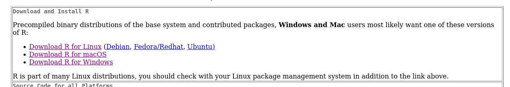
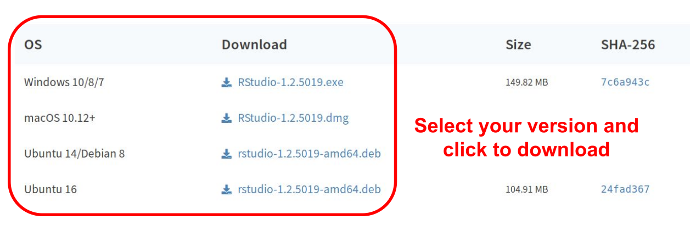
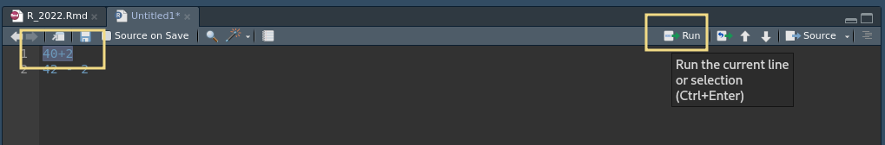
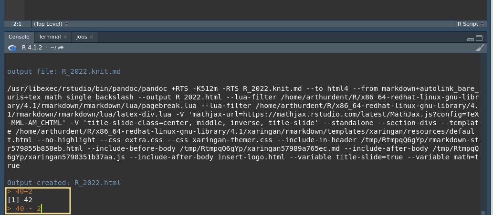
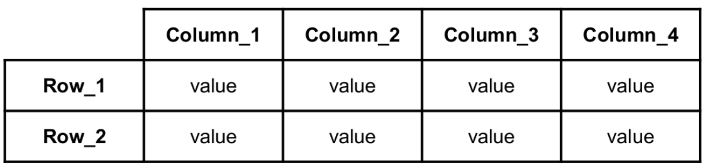

```{r setup, include=FALSE}
options(htmltools.dir.version = FALSE)

```
```{r xaringan-themer, include=FALSE, warning=FALSE}
library(xaringanthemer)
  #style_mono_accent(
  style_duo(
  primary_color = "#f2DB86",
  #base_color = "#B2284B",
  secondary_color = "#32577F",

)
library(gt)

# style_duo_accent(primary_color = "#002fa7", secondary_color = "#C5A900")

```

class: center, middle
## What is R?
R is a language and environment for statistical computing and graphics

R provides tools for statistical analysis and data visualisation
---
class: middle
### Pros
- Free (as in "free speech", but also as in "free beer")
- It runs on all platforms (Windows, Mac or Linux)
- Can be extended with packages
- Large community: easy to get help
- R supports fairly large datasets (assuming you have enough RAM)

### Cons
- You have to learn how to use a scripting language
- R supports only fairly large datasets

---
class: center, middle
background-image: url("img/coniglio.jpg")
background-size: contain

.pull-left[
## Aim: coding in R without being too scared]
---
class: inverse, middle, center
# Installation
- Installing R

- Installing RStudio, the graphical interface
---
## Installing R
Download R from the http://cran.mirror.garr.it/mirrors/CRAN/ web page and install it

---
## RStudio
For this course we will use __RStudio__ . It is a graphical interface for R, that helps the programmer making it more user-friendly.

*After* installing R, download RStudio from https://www.rstudio.com/products/rstudio/download/#download

---
# RStudio download


---
## Open RStudio
To open RStudio you can:
.pull-right[]
.pull-left[
- Double Click on the Rstudio icon 

- Open a terminal and run
  - On Linux: __rstudio__
  - On Mac: __open -na Rstudio__ ]
---
## First look into RStudio


---
## Run a command
Within the Code Editor:

- Executing a Single Line:
Ctrl+Enter (or use the Run toolbar button) to execute the line of code where the cursor currently resides 

- Executing Multiple Lines:
Ctrl+Enter key (or use the Run toolbar button) after selecting the lines

---
## Run a command
Within the Console:

Enter commands at the prompt (> by default)

Each command will be executed one at a time
---
class:inverse, middle, center
## Let's start the practicals


---
##  Getting our feet wet

To start we can use R as a fancy calculator

Using the basic mathematical operators in the console
```{r, include=FALSE}
df_mat <- data.frame(Operator=c("+","-","*","/","^"),
                Description=c("Sum","Subtraction","Multiplication","Division","Exponentiation")
)
gt_tbl <- gt(df_mat)
```

```{r, echo = FALSE, include= TRUE, results='asis'}
gt_tbl
```
---
##  Getting our feet wet
.pull.left[]
Try these commands in the console

```{r eval= FALSE}
40 + 2

44 - 2

42/11

4^3
```


---
## Getting our feet wet

Executing the code should get you these results
```{r eval= TRUE}

40 + 2

44- 2

42/11

4^3
```

---
## Logical operators

You can use logical operators

The chechk if a condition is true
```{r, include=FALSE}
df_log <- data.frame(Operator=c(">",">=","<","<=","==","!="),
                Description=c("Greater than",
                              "Greater than or equal tp",
                              "Lesser than",
                              "Lesser than or equal to",
                              "Equal to",
                              "Not equal to")
)
gt_tbl <- gt(df_log)
```

```{r, echo = FALSE, include= TRUE, results='asis'}
gt_tbl
```
---
## Logical operators
Try these in the command line
```{r eval= FALSE}

42 > 42

42 >= 42

42 == 42

42 != 71
```
---
## Logical operators
```{r eval= TRUE}

42 > 42

42 >= 42

42 == 41

42 != 71
```


---

- RStudio has a very useful feature called "code completion": use the Tab key to complete the
full name of an object or a function
- Comments can be used to explain R code, and to make it more readable. It can also be used
to prevent execution when testing alternative code. Comments starts with a #. When
executing the R-code, R will ignore anything that starts with #
---
## R objects
The entities that R creates and manipulates are __objects__

__Objects__ are stored by name in the active memory of the
computer

You can check __objects__ in the __Environment__ window

To create an __object__, we need to give it a name followed by the assignment operator "<-":
```{r eval=FALSE, tidy=FALSE,comment='#'}
variable_name <- value
```
---
# Example
```{r eval=TRUE, tidy=FALSE,comment='#'}
answer <- 42
```

```{r eval=TRUE, tidy=FALSE,comment='#'}
answer
answer * 2
answer - answer
answer > 5
```
---
## R objects
1) __Object__ name must start with a letter and can be a combination of letters, digits,
period(.) and underscore(_). If it starts with period(.), it cannot be followed by a digit

2) __Object__ names are case-sensitive (age, Age and AGE are three different variables)

3) Reserved words cannot be used as __Object__ name (TRUE, FALSE, NULL, if...)
---
## Variables and vectors
Variable: single value (number or a string). Strings must be enclosed in
quotes, either double(“ “) or single (‘ ‘)
```{r eval=FALSE, tidy=FALSE,comment='#'}
name <- "string"
```

Vector: an ordered collection of values. Create it using c() function with its elements separated by a comma
```{r eval=FALSE, tidy=FALSE,comment='#'}
hobbits <- c("Frodo", "Sam")
```
---
## R data types
Numeric: decimal values
```{r eval=FALSE, tidy=FALSE,comment='#'}
grade <- 18
```
Character: letters or numbers enclosed by quotes
```{r eval=FALSE, tidy=FALSE,comment='#'}
my_name <- “Bilbo”
```

Logical: a variable that can have a value of TRUE or FALSE
```{r eval=FALSE, tidy=FALSE,comment='#'}
logic_var1 <- TRUE
```
---
# Practicals
How to check the class of a variable:
```{r eval=FALSE, tidy=FALSE,comment='#'}
class(objects)
```

Try:

```{r eval=FALSE, tidy=FALSE,comment='#'}
var1 <- "777"
var2 <- 777
class(var1)
class(var2)
```
---
# Practicals
To change the variable/vector type:
From any type to character:
```{r eval=FALSE, tidy=FALSE,comment='#'}
name <- as.character(name)
```

From any type to numeric (a character cannot be changed into a number):
```{r eval=FALSE, tidy=FALSE,comment='#'}
name <- as.numeric(name)
```
From any type to factor:
```{r eval=FALSE, tidy=FALSE,comment='#'}
name <- as.factor(name)
```
---

## Factors
Factor: objects which are used to group data into categories. Each group is assigned to a
level which identifies the group

How to convert a variable into a factor:
```{r eval=FALSE, tidy=FALSE,comment='#'}
variable_name <- as.factor(variable_name)


f <- c("East","West","East","North","North")
class(f) # It’s a character
f <- as.factor(f) #Function to convert a variable into a factor
```
Check levels of a factor:
```{r eval=FALSE}
levels(variable_name)
levels(f) # "East" "North" "West"
```
By default, R sorts the levels of a factor alphabetically

---
## Data frame
a table in which each column contains values of one variable and each row contains
one set of values from each column.

---
## Data frame
How to create a data frame from vectors:
```{r eval=FALSE}
dataframe_name <- data.frame(column1,column2,column3...)
```
Let’s first create 3 vectors
```{r eval=TRUE}
hobbits <- c("Frodo","Merry","Pippin","Sam")
age <- c(51,37,29,39)
ringbearer <- c("yes","no","no","briefly")
# and now let’s use these vectors to build our data frame
df <- data.frame(hobbits,age,ringbearer)
```
```{r eval=TRUE, include=FALSE}
gt_tbl <- gt(df)
```
---
## Data frame

```{r eval=TRUE, echo = FALSE}
gt_tbl
```
Also can be done in a single command
```{r eval=TRUE}
data.frame(hobbits <- c("Frodo","Merry","Pippin","Sam"),
           age <- c(51,37,29,39),
           ringbearer <- c("yes","no","no","briefly"))
```
---
## Data frame
To access the columns of a data frame:
```{r eval=FALSE}
dataframe_name$column_name
```
To change the object type:
```{r eval=FALSE}
dataframe_name$column_name <- as.character(dataframe_name$column_name)
```
As an example
```{r eval=TRUE}
df$hobbits
```
---
## External files
Table can be (and often are) saved as csv/tsv files

Text files, in which __v__alues are __s__eparated by a __c__omma (,) or by a __t__ab
```
Frodo,51,yes
Merry,37,no
Pippin,29,no
Sam,39,briefly
```
---
To read an external file 
```{r eval=FALSE}
dataframe_name <- read.csv("File_name", 
                           header = T, sep=",",
                           na.strings =value/values)
```

---
## Install and load libraries
R, by default, only comes with a restricted number of functions

To extend the functionalities we can install external packages 

To install a package in R:

install.packages("library_name")

after you have installed you can load it with
library(library_name)
Example:
```{r eval=FALSE, tidy=FALSE,comment='#'}
# There's a time and place for everything
# but do not run this code now
install.packages(“ggplot2”)
library(ggplot2)
```
---

# Some Tips


