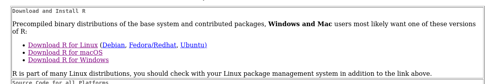
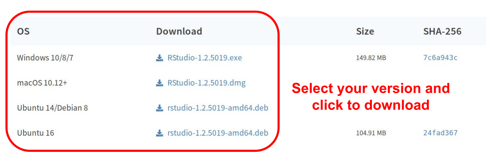

```{r setup, include=FALSE}
options(htmltools.dir.version = FALSE)

```
```{r xaringan-themer, include=FALSE, warning=FALSE}
library(xaringanthemer)
  #style_mono_accent(
  style_duo(
  primary_color = "#f2DB86",
  #base_color = "#B2284B",
  secondary_color = "#32577F",

)
library(gt)

# style_duo_accent(primary_color = "#002fa7", secondary_color = "#C5A900")

```

class: center, middle
## What is R?
.pull-left[
R is a language and environment for statistical computing and graphics

R provides tools for statistical analysis and data visualisation]
.pull-right[]
---
class: middle
### Pros
- Free (as in "free speech", but also as in "free beer")
- It runs on all platforms (Windows, Mac or Linux)
- Can be extended with packages
- Large community: easy to get help
- R supports fairly large datasets (assuming you have enough RAM)

### Cons
- You have to learn how to use a scripting language
- R natively supports only fairly large datasets 

---
class: center, middle
background-image: url("img/coniglio.jpg")
background-size: contain

.pull-left[
## Aim: coding in R without being too scared]
---
class: inverse, middle, center
# Installation
- Installing R

- Installing RStudio, the graphical interface
---
## Installing R
Download R from the http://cran.mirror.garr.it/mirrors/CRAN/ web page and install it

---
## RStudio
For this course we will use __RStudio__ . It is a graphical interface for R, that helps the programmer making it more user-friendly.

*After* installing R, download RStudio from https://www.rstudio.com/products/rstudio/download/#download

---
# RStudio download


---
class: middle
## Plan

#### 4 Lessons
- Introduction
- Basic functions
- Plotting
- Hypothesis testing

+
#### 1 Lesson
- Simulation of exam
---
## Files

The zip file *R_lessons_2021_2022* in the course gdrive contains:
- the course slides in pdf and html (including this one), *R_lesson0* *R_lesson1*..
- the *R_commands.pdf*, a cheatsheet with the commands to use for the exam (it will be also provided during the exam)
- *patric_redux.csv*, the table we will use for the lessons

The course material is also available online at https://tiagonardi.github.io/R_intro_2022/
---
## Other resources

https://github.com/rstudio/cheatsheets/blob/main/base-r.pdf