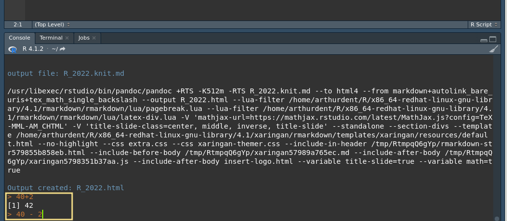
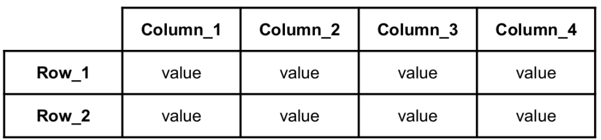

```{r setup, include=FALSE}
options(htmltools.dir.version = FALSE)
```
```{r xaringan-themer, include=FALSE, warning=FALSE}
library(xaringanthemer)
  #style_mono_accent(
  style_duo(
  primary_color = "#f2DB86",
  #base_color = "#B2284B",
  secondary_color = "#32577F",

)
library(gt)

# style_duo_accent(primary_color = "#002fa7", secondary_color = "#C5A900")

```
class: middle
## Open RStudio
To open RStudio you can:
.pull-right[]
.pull-left[
- Double Click on the Rstudio icon 

- Open a terminal and run
  - On Linux: __rstudio__
  - On Mac: __open -na Rstudio__ ]
---
## First look into RStudio

You can change the order and the window(pane) size from the settings
---
# 1 - Code Editor
The __Code Editor__ - also known as __Source Pane__ - is a notepad for your R code

Script files written in R code are typically saved with a .R extension

You can save (and load) your code on your computer

Code written in the __Source Pane__ will not be evaluated until you expressly run it

- Executing a Single Line:
Ctrl+Enter (or use the Run toolbar button) to execute the line of code where the cursor currently resides 

- Executing Multiple Lines:
Ctrl+Enter (or use the Run toolbar button) after selecting the lines


---
## 2 - Console

The core of R, it's where the code is evaluated

The prompt (__>__ by default) indicates that the console is ready to run new code

Click on the __console__, type directly the commands and press enter ↵ to run them


---
## 2 - Console
Each command will be executed one at a time

You can run commands or in the console or in the __Source Pane__

The console is useful for a quick test or for debugging

Previous commands will be logged in the __History__

But better to write most of your code on the __Code Editor__

---
## 3- Workspace and History
The Environment tab will contain all your data and objects

You can click on objects to inspect them

You will have informations such as the number of rows and observation

History contain previous used commands


---
## 4 - Plots and Files
This pane contains various informations:

- Files: your  __present working directory__, and the file present in that folder. You can change your working directory with a graphic interface from here

- Plots: your plots (duh), you can zoom on them and export in various formats and sizes

- Packages: you can load (and unload) previously downloaded __packages__ (extension of R capability)

- Help: online R documentation, you can search a command on it, or write in the console *?command*
```{r, eval=FALSE}
?chisq.test
```
---
class: middle
## Two tips
Remember: 
- RStudio (as other IDEs) has a very useful feature called "code completion": use the Tab key (↹) to autocomplete the full name of an object or a function, or a file/folder location

- Comments can be used to explain R code, and to make it more readable. You can also use them to prevent execution when testing alternative code. Comments starts with a #, when executing the code R will ignore anything that starts with #
---
class:inverse, middle, center
## Let's start


---
##  Getting our feet wet

To start, we can use R as a fancy calculator

The commands are the the basic mathematical operators
```{r, include=FALSE}
df_mat <- data.frame(Operator=c("+","-","*","/","^"),
                Description=c("Sum","Subtraction","Multiplication","Division","Exponentiation")
)
gt_tbl <- gt(df_mat)
```

```{r, echo = FALSE, include= TRUE, results='asis'}
gt_tbl
```
---
##  Getting our feet wet
.pull.left[]
Try these commands in the __console__

```{r eval= FALSE}
40 + 2

44 - 2

42/11

4^3
```


---
## Getting our feet wet

Executing the code should get you these results
```{r eval= TRUE}

40 + 2

44 - 2

42/11

4^3
```

---
## Logical operators

You can use logical operators: they check if a statement is true and output a Boolean value (TRUE/FALSE)

The logical operators are:
```{r, include=FALSE}
df_log <- data.frame(Operator=c(">",">=","<","<=","==","!=", "&","|","!"),
                Description=c("Greater than",
                              "Greater than or equal to",
                              "Lesser than",
                              "Lesser than or equal to",
                              "Equal to",
                              "Not equal to",
                              "AND",
                              "OR",
                              "NOT")
)
gt_tbl <- gt(df_log)
```


```{r, echo = FALSE, include= TRUE, results='asis'}
gt_tbl
```
---
## Logical operators
.pull.left[]
Try these commands in the __console__
```{r eval= FALSE}

42 > 42

42 >= 42

42 == 42

42 != 71

42 == 42 | 42 != 42 

42 == 42 & 42 != 42
```
---
class: hide-logo
```{r eval= TRUE}

42 > 42

42 >= 42

42 == 41

42 != 71

42 == 42 | 42 != 42

42 == 42 & 42 != 42
```
---
class: middle
##  AND OR

#### OR *|*
If at least one the statements is __TRUE__ -> __TRUE__

If both are __FALSE__ -> __FALSE__
#### AND *&*
If two statements are both __TRUE__ -> __TRUE__

If at least one of the statements is __FALSE__ -> __FALSE__
---
class: middle
## R objects
The entities that R creates and manipulates are __objects__

__Objects__ are stored by name in the active memory of the
computer

To create an __object__, we need to give it a name followed by the assignment operator "<-"

```{r eval=FALSE, tidy=FALSE,comment='#'}
variable_name <- value
```

After assigning an object it should appear in the __environment tab__, where you can inspect it

You can call the object by its name and use it with any function
---
class: middle
## R objects
1) __Object__ name must start with a letter and can be a combination of letters, digits,
period *.* and underscore *_*. If it starts with period *.*, it cannot be followed by a digit

2) __Object__ names are case-sensitive (*age*, *Age* and *AGE* are three different variables)

3) Reserved words cannot be used as __Object__ name (TRUE, FALSE, NULL, if...)

---
# Try it!


Assign a number to a variable of your choosing
```{r eval=FALSE, tidy=FALSE,comment='#'}
answer <- 42
Try some operations (arithmetic and logical)
```
--
```{r eval=FALSE, tidy=FALSE,comment='#'}
answer
answer * 2
answer - answer
answer > 5
```
---
# Try it!
```{r eval=TRUE, tidy=FALSE,comment='#'}
answer <- 42
answer
answer * 2
answer - answer
answer > 5
```
---
## R objects

If you assign a new value to a named __object__ you overwrite it

```{r eval=TRUE, tidy=FALSE,comment='#'}
answer <- 42
answer
answer <- 20
answer
```
You can assign a variable to the variable itself
```{r eval=TRUE, tidy=FALSE,comment='#'}
answer <- answer * 2
answer
```
---
## Variables and vectors
Strings (a series of letters) must be enclosed in
quotes, either double(“ “) or single (‘ ‘)

Numbers enclosed in quotes are considered strings, not numbers and can't be used for mathematical operations

#### Variable
single value (number or a string)
```{r eval=FALSE, tidy=FALSE,comment='#'}
name <- "string"
```

#### Vector
an ordered collection of values. Create it using c() function with its elements separated by a comma
```{r eval=FALSE, tidy=FALSE,comment='#'}
hobbits <- c("Frodo", "Sam")
```
---
class: middle
## R data types
#### Numeric
decimal values
```{r eval=FALSE, tidy=FALSE,comment='#'}
grade <- 18
```
#### Character
letters or numbers enclosed by quotes
```{r eval=FALSE, tidy=FALSE,comment='#'}
my_name <- “Bilbo”
```

#### Logical
a variable that can have a value of TRUE or FALSE
```{r eval=FALSE, tidy=FALSE,comment='#'}
logic_var1 <- TRUE
```
---
## Exercise


How to check the class of a variable:
```{r eval=FALSE, tidy=FALSE,comment='#'}
class(objects)
```

Try:

```{r eval=FALSE, tidy=FALSE,comment='#'}
var1 <- "777"
var2 <- 777
class(var1)
class(var2)
```
---
class: middle
## Changing types
To change the variable/vector type:
From any type to character:
```{r eval=FALSE, tidy=FALSE,comment='#'}
name <- as.character(name)
```

From any type to numeric (a character cannot be changed into a number):
```{r eval=FALSE, tidy=FALSE,comment='#'}
name <- as.numeric(name)
```
From any type to factor:
```{r eval=FALSE, tidy=FALSE,comment='#'}
name <- as.factor(name)
```
---
## Factors
Factor: objects which are used to group data into categories. Each group is assigned to a
level which identifies the group

How to convert a variable into a factor:
```{r eval=FALSE, tidy=FALSE,comment='#'}
variable_name <- as.factor(variable_name)


f <- c("East","West","East","North","North")
class(f) # It’s a character
f <- as.factor(f) #Function to convert a variable into a factor
```
Check levels of a factor:
```{r eval=FALSE}
levels(variable_name)
levels(f) # "East" "North" "West"
```
By default, R sorts the levels of a factor alphabetically
---
## Data frames
A table in which each __column__ contains values of one variable and each row contains
one set of values from each column.

---
## Data frames


To create a data frame from vectors
```{r eval=FALSE}
dataframe_name <- data.frame(column1,column2,column3...)
```
Let’s first create 3 vectors (they must be of the same length)
```{r eval=TRUE}
hobbits <- c("Frodo","Merry","Pippin","Sam")
age <- c(51,37,29,39)
ringbearer <- c("yes","no","no","briefly")
# and now let’s use these vectors to build our data frame
df <- data.frame(hobbits,age,ringbearer)
```
---
## Data frames
Inspect the dataframe clicking on it in the __environment tab__

Or write in the console
```{r eval=FALSE}
View(df)
```
```{r eval=TRUE, echo = FALSE}
gt_tbl <- gt(df)
gt_tbl
```

Probably better to codify the last column as a boolean variable or use only "yes"/"no"

Being consistent is fundamental when using tables
---
## Data frames
Also it can be done in a single command
```{r eval=TRUE}
data.frame(hobbits <- c("Frodo","Merry","Pippin","Sam"),
           age <- c(51,37,29,39),
           ringbearer <- c("yes","no","no","briefly"))
```
---
class: middle
## Data frames
To access the __columns__ of a data frame:
```{r eval=FALSE}
dataframe_name$column_name
```
To change the __object__ type:
```{r eval=FALSE}
dataframe_name$column_name <- as.character(dataframe_name$column_name)
```
You can add a column to a __data frame__ assigning a __vector__ to it
```{r eval=FALSE}
dataframe_name$new_column <- vector
```
---
class: middle
## Exercise
.pull-right[]
.pull-left[
Create a vector to add to the data frame

It should have the same length of the other columns

Add it to the data frame and inspect it

]
---
## Results
```{r eval=TRUE}
breakfast_taken <- c(2,3,2,4)
df$breakfasts <- breakfast_taken
```
```{r eval=TRUE, echo=FALSE}
colazione_tbl <- gt(df)
colazione_tbl
```
---
class: inverse, middle, center
# How to manage external files
---
class: middle
## Set working directory
Every time you start a R session it will start in a specific directory

To know your current __working directory__ you can use the command
```{r eval=FALSE}
getwd()
```
To change the __working directory__ directory 
```{r eval=FALSE}
setwd("/path/to/my/directory")
```
Use *../* to go to the parent directory (the folder containing your current folder) 

---
## Set working directory
You can also set up the directory through the graphical interface: 

Click on the three dots in the __files tab__ to select a directory


And then click on "More" on the __files tab__ and select *Set As Working Directory*

---
## Tables

Table can be (and often are) saved as csv/tsv files

These are text files, in which __v__alues are __s__eparated by a __c__omma (,) or by a __t__ab

If you open a CSV table with a notepad you will read something like
```
Frodo,51,yes
Merry,37,no
Pippin,29,no
Sam,39,briefly
```
A TSV table will look like
```
Frodo   51    yes
Merry   37    no
Pippin  29    no
Sam   39    briefly
```
Other separators are possible but most of the cases will use comma, semicolons or tab

---
class: middle
## Tables

Another aspect is the presence of a __header__

The __header__ is a first row that contains the names of the columns

```
Hobbit,age,ringbearer
Frodo,51,yes
Merry,37,no
Pippin,29,no
Sam,39,briefly
```
When you load a file check if the table contains a __header__
Possible mistakes:
- using the first row as column names
- using the column names as values

---
## Open an external table
We will work with the table *patric_redux.csv*

You can download the table from the course gdrive, and save it into a folder of your choice

https://drive.google.com/file/d/1UMmE_KZial63WJVleg4xbX6GXCtCTd45/view?usp=sharing

Otherwise you can download it from github

https://github.com/tiagonardi/R_intro_2022/blob/gh-pages/patric_redux.csv

Change your R __working directory__ to the folder where you have saved the table
```{r eval=FALSE}
setwd("/path/to/my/directory")
```

Or navigate to the folder using __Files tab__
---
## Reading a table

You can read the table using this command
```{r eval=FALSE}
dataframe_name <- read.csv("File_name", 
                           header = TRUE,
                           sep=",")
```
The first parameter of "read.csv" is the name of the file and its position relative to the __working directory__

The second specify the presence of a header

The third which separator has been used in the table

__Functions__ have often default value for some of the parameters that are used if are not specified

For example *read.csv* will use *sep=","* if not specified
---
## Reading a table
There are various commands that can be used to read a table in R

They are all variation of the more general command *read.table*, with different defaults
```{r, include=FALSE}
elenco_tab <- data.frame(Command=c("read.table","read.csv","read.csv2","read.delim","read.delim2"),
                Defaults=c("sep=' ', header=FALSE, dec = '.'",
                              "sep=',', header=TRUE, dec = '.'",
                              "sep=';', header=TRUE, dec = ','",
                              "sep='\\t' ,header=TRUE, dec = '.'",
                              "sep='\\t', header=TRUE, dec = ','"
                              )
)
gt_elenco_tab <- gt(elenco_tab)
```

```{r, echo = FALSE, include= TRUE, results='asis'}
gt_elenco_tab
```

The read __functions__ indicated with a 2 are designed for countries that use "," to indicate decimals (e.g. Italy 🇮🇹)
---
## Exercise
.pull.left[]
After setting up the __working directory__ read the downloaded table, and assign it to an object named *patric_table* 
```{r eval=TRUE}
patric_table <- read.csv("patric_redux.csv",header = T,
                           sep=",")
```
You can run the object name in the __console__ to have a look at it, or (better) click the name in the __environment tab__ or use *view(patric_table)*

Also try to read the table with a wrong separator (";")
```{r eval=TRUE}
wrong_table <- read.csv2("patric_redux.csv")
```
---
# Exercise
Inspect *patric_table* clicking on it on the __environment tab__

---
# Practicals
Inspect also the *wrong_table* to see what happens with a wrong separator


R was unable to divide correctly the columns ("1 variable")

---
# Exercises
.pull.left[]
Check if the table has been imported correctly
```{r eval=FALSE}
head(dataframe_name) # returns the first part of a data frame
str(dataframe_name) # compactly display the internal structure
summary(dataframe_name) # display statistics for sample and subgroups
```
Check column and row names in *patric_table*:
```{r names-label,eval=FALSE}
colnames(dataframe_name)
rownames(dataframe_name)
```
---
## Results
```{r eval=TRUE}
head(patric_table)
```
---
## Results
```{r eval=TRUE}
str(patric_table)
```
---
## Results
```{r eval=TRUE}
summary(patric_table)
```
---
## Results
```{r eval=TRUE}
colnames(patric_table)
rownames(patric_table)
```
