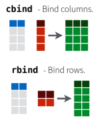
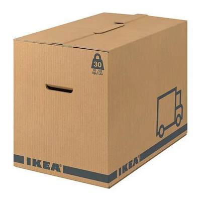
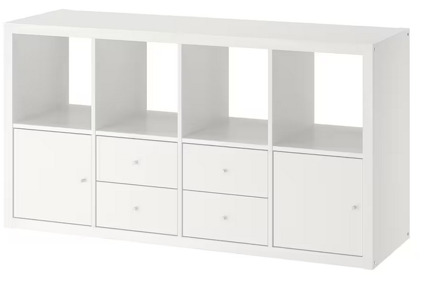

```{r setup, include=FALSE}
options(htmltools.dir.version = FALSE)

```
```{r xaringan-themer, include=FALSE, warning=FALSE}
library(xaringanthemer)
  #style_mono_accent(
  style_duo(
  primary_color = "#f2DB86",
  #base_color = "#B2284B",
  secondary_color = "#32577F",

)
library(gt)

# style_duo_accent(primary_color = "#002fa7", secondary_color = "#C5A900")

```
## Vectors


Let’s first create a __vector__, with 5 __elements__:
```{r, include=TRUE}
x <- c(2, 5, 8, 1, 2)
```
You can access elements inside a vector using their index position, using the square brackets *[ ]*

```{r, include=TRUE}
x[2] # show the second element
```
To select multiple elements use the concatenate function
```{r, include=TRUE}
x[c(1,2)] # show the first and second element
```
---
class: middle
## Indexing the vectors
Try these operations on your vector
```{r, eval=FALSE}
vector[3:5]
vector[c(1,3:5)]
vector[-2]
vector[vector > 2]
```
Can you guess what you were extracting with these commands?
---
## Indexing the vectors
You can select a slice of the vector using the colon *:*
```{r, include=TRUE}
x[3:5] # show all elements from a starting index (3) to an ending index (5) (slicing)
```
You can combine both methods
```{r, include=TRUE}
x[c(1,3:5)]
```
You can get all the elements barring the elements with a minus before it *-*
```{r, include=TRUE}
x[-2]
```
---
## Indexing the vectors
Chose a numerical value and try these commands with you vector
```{r, eval=FALSE}
vector[vector > value]
vector > value
```
Why these results are different?

Can you guess it?

Write also a vector with only boolean values (TRUE/FALSE) with the same length of your first vector
```{r, eval=FALSE}
vector2 <- c(FALSE,TRUE,TRUE,FALSE,FALSE)
vector[vector2]
```
---
## Indexing the vectors
You can select elements in the vector using logical conditions
```{r, include=TRUE}
x[x > 2] # show all elements greater than 2
```
To access the vector you have to specify the values *inside* the brackets.

Otherwise you apply the logical operation to all elements in the vector
```{r}
x > 2
```

You can supply a logical vector to get only the elements in the positions with TRUE
```{r}
mr_boole <- c(FALSE,TRUE,TRUE,FALSE,FALSE)
x[mr_boole]
```
---
## Vectors
As you can assign values to an __object__

You can assign values inside a vector

```{r, include=TRUE}
x[3]
x[3] <- 11 # replace the third element with the number 11
x[3]
```

---
## Rows and columns
Let's load the usual table (remember the working directory)
```{r, include = TRUE}
db <- read.csv("patric_redux.csv", header = T)
db1 <- db # let's make a copy of the data frame
head(db)
```
---
## Rows and columns

To change the name use the *colnames()* functions

To get a column use the column number like a vector index
``` {r}
colnames(db1) # It shows column names
colnames(db1)[4] <- "bp" # change the fourth column name
colnames(db1)
colnames(db1)[4] # Get only the fourth column
```

---
## Rows and columns
How to set row names:
``` {r}
rownames(db1) # It shows row names
rownames(db1) <- db1$ID # We set as rownames all values from column
```

---
## Rows and columns

``` {r}
head(db) # read the first 6 rows
```
---
## Rows and columns
``` {r}
head(db1) # see the differences between this and the previous table
```
---
## Cleaning up
To remove a column assign a __NULL__ value to it
``` {r}
db1$Contigs <- NULL # delete the column
```

If you want to remove an __object__ from R use
``` {r eval=FALSE}
rm(x)
```
It will free your memory from that specified __object__

The __object__ will disappear from the __environment tab__
---
## Accessing the data frame 
Extract columns and rows from a data frame (almost) like you access a __vector__

You can use the position indexes inside square brackets

First value is the row, the second the column

You can use position or names if you already set up row/column names
``` {r, eval= FALSE}
dataframe_name[1, 1]
dataframe_name["row_name", "column_name"]
```
If don't specify one of the two values you get all elements (All rows/All columns)
``` {r, eval= FALSE}
dataframe_name[,1] # all rows, first column
dataframe_name[1,] # first row, all column
```
---
## Accessing the data frame 
``` {r, eval=FALSE}
dataframe_name["row_name", "column_name"]
dataframe_name[row_index, column_index]
dataframe_name[ , "column_name"]
dataframe_name[ , column_index]
dataframe_name["row_name", ]
dataframe_name[row_index,]
```
Try to access: 

the full row of sample *24H*

the *Source* of sample *EBD10-058*

the full column of *Isolation_location*

From the third to the 13th row the column *PATRIC.CDS"

All rows, excluding from the 4th row to the 10th, columns *bp* *GC.Content* 

---
## Accessing the data frame 
```{r, eval=TRUE}
db1["24H",]
db1["EBD10-058","Source"]
db1[,"Isolation_location"]
```
---
## Accessing the data frame 
```{r, eval=TRUE}
db1[1:13,"PATRIC.CDS"] #check the rows inspecting db1
db1[-(4:10),c("bp","GC.Content")]
```
---
## Accessing the data frame 
```{r, eval=FALSE}
dataframe_name[ , c("column_1_name", "column_2_name")]
dataframe_name[ , c(first_column_index, second_column_index)]
dataframe_name[c("row_1_name", "row_2_name"), ]
dataframe_name[c(first_row_index, second_row_index), ]
dataframe_name[ , c(first_column_index : last_column_index)]
dataframe_name[c(first_row_index : last_row_index),]
```
You can mix and match different ways to access the data
```{r, eval=FALSE}
db[1,4] # First rown and 4th column
db[1,"Contigs"] #First row and column "Contigs"
db[35:78,] # From row 35 to 78 and all columns
db[,c(4,5)] #All rows and the 4th and 5th column
```
---
class: inverse, middle
.pull-left[
## Remember the typeof() function?
]
.pull-right[]
---
## Object type
With the various form of extraction you get similar results but different data types
``` {r, eval= FALSE}
dataframe_name[column_index]
dataframe_name[[column_index]] 
dataframe_name[, column_index] # Pay attention to the comma
dataframe_name$column_index
dataframe_name$column_index[row_index]
```
Chose a column from the database and try the diffferent options

Assign these values to a new __objects__

Look at how they appear in the environment

What's the difference?
---
## Object type
``` {r, eval= TRUE}
typeof(db1[1])
typeof(db1[, 1])
typeof(db1[[1]])
db1[1]

```
---
## Not Available
In R, missing values are represented by the symbol NA (not available)

To test for missing values
``` {r}
y <- c(1,2,3,NA)
is.na (y) #find which value is missing
```
To remove missing values from a data frame:
``` {r, eval= FALSE}
db2 <- db1[complete.cases(db1), ] # remove all rows with NA values
```
---
class: middle
## Data frame functions
*Table* creates a tabular results of categorical variables
``` {r, eval= FALSE}
table(datafra$column) 
```
``` {r, eval= TRUE}
table(db1$Isolation_location)
```

---
class: middle
## Data frame functions
*gsub* takes an input value and replace it with another one
``` {r, eval= TRUE}
db1$Isolation_location<-gsub("Barad-dur",
                             "Varallo Pombia",
                             db1$Isolation_location)
```
the word “Barad-dur” is replaced with “Varallo Pombia” and save the replaced column in the dataframe

Try to replace something from the column *Source*
---
class: middle
## Data frame functions
*unique* identify and eliminate duplicated values in an object. The object can be a vector or
a data frame. On data frames the function removes duplicated rows
``` {r, eval= TRUE}
country <- db1$Isolation_location
unique_country <- unique(country)
```
---
class: middle
## Functions on data frames


How to check if a value is present in a column or vector:
``` {r, eval= FALSE}
value %in% vector
```
To extract the first location that has the value of interest:
``` {r, eval= FALSE}
match("value", dataframe_name$column_name)
```
Use these functions to see if one value of you choice is present in the column *Isolation_location*, and see which row has the first occurrence 
---
class: middle
## Functions on data frames
``` {r, eval= TRUE}
"Varallo Pombia" %in% db1$Isolation_location
```

``` {r, eval= TRUE}
match("Varallo Pombia", db1$Isolation_location)
db1$Isolation_location[7]
```
---
class: middle, inverse
.pull-left[## Subsetting and Binding]
.pull-right[

### Cutting, pasting and modifying data frames ]
---
## Subsetting
From a table, extract only a part of it, using a __pattern__

``` {r eval=FALSE}
subset(dataframe_name, dataframe_name$column_name logical_condition)
```
For example, if we want to keep genomes not too fragmented we can select elements with less than 100 contigs
``` {r eval=TRUE}
decent_qual <- subset(db, db$Contigs < 100)
```
You can use more than one logical condition using AND(*&*) OR (*|*), or just using two subsets
```{r}
gondor <- subset(db,db$Contigs<100 &
                 db$Isolation_location=="Gondor")
```
You can subset for columns:
``` {r eval=FALSE}
red_table <- subset(db,select = c(1, 3, 4, 5))
```
---
# Logical operators
```{r, include=FALSE}
df_log <- data.frame(Operator=c(">",">=","<","<=","==","!=", "&","|","!"),
                Description=c("Greater than",
                              "Greater than or equal tp",
                              "Lesser than",
                              "Lesser than or equal to",
                              "Equal to",
                              "Not equal to",
                              "AND",
                              "OR",
                              "NOT")
)
gt_tbl <- gt(df_log)
```
```{r, echo = FALSE, include= TRUE, results='asis'}
gt_tbl
```
---
class: middle
## Exercise


Get a table with only genomes from Elf and 4500000 as genome length
``` {r eval=FALSE}
subset(dataframe_name, dataframe_name$column_name logical_condition)
```
---
## Exercise
``` {r eval=TRUE}
rohan <- subset(db,db$Genome.Length > 4500000 &
                 db$Source=="Elf")
```
```{r, echo=FALSE}
g_r <- gt(rohan)
g_r
```
---
class: middle
## Dropping levels
When subsetting data frames there may be some levels (for factors) that are unused

Remove them because they may alter downstream analyses
``` {r eval=FALSE}
table(data_frame$column)
```
If you get a factor with a value of 0 you should  drop the levels
``` {r eval=FALSE}
dataframe_name <- droplevels (dataframe_name)
```
---
class: middle
## Binding
.pull-left[
#### Combining vectors to a a dataframe:

- #### ___c___*bind* to bind a __c__olumn to a dataframe

- #### ___r___*bind* to bind a __r__ow to a dataframe

- #### vectors have to be of the same lenght]
.pull-right[]
---
class: middle
# Binding - Pasting

Paste combine strings to a single string, or two vectors of strings
```{r, eval= FALSE}
new_vector<-paste(string_vector1,string_vector2,sep=" ")
```
In the new string/vector the original strings will be separated by the separator (*sep=*)

If you don't want any separation write *sep=""*

You can assign the new vector to a dataframe or use it to replace a column

You can use a fixed string
```{r, eval= FALSE}
new_vector<-paste("fixed_string",string_vector2,sep="")
```
---
class: middle
## Exercise


Create 2 subsets:
- one with only samples from *Erebor* 
- one with only samples from *Barad-dur*

Bind the two tables into a single dataframe, and add a column pasting *Isolation_location* and *Source* columns
``` {r, eval= FALSE}
new_df <- rbind(df1,df2) #new_r now is a new row of the data frame
new_vector<-paste(string_vector1,string_vector2,sep=" ")
```
---
class: middle
# Exercise

``` {r, eval= TRUE}
Erebor <- subset(db, db$Isolation_location=="Erebor")
Barad_dur <- subset(db, db$Isolation_location=="Barad-dur")
db2 <- rbind(Erebor, Barad_dur)
db2$newco <- paste(db2$Isolation_location,db2$Source)
```
---
# Sort
Sort a data frame in R (by default, sorting is ASCENDING)
``` {r, eval= FALSE}
dataframe_name <- dataframe_name[order(dataframe_name$column), ]
```

```
db2<- db2[order(db2$Contigs),] # sort the whole data frame by column “Contigs”
```
---
## Vector functions
These can be applied in the same way on vectors
```{r, eval=FALSE}
function(vector)
```
*length* returns the length of the vector (or the columns number in a dataframe)

*max* returns the maximum value of a numeric vector or column

*min* returns the minimum value of a numeric vector or column

*range* it outputs the smallest and largest values of the numeric vector or column
---
# Exercise


- Get the range of the *GC.Content*

- Get the max value of contigs in only Hobbit samples

- Get the minimum value of *PATRIC.CDS* in samples with less than 100 contigs
---
## Results
``` {r, eval= TRUE}
range(db$GC.Content)
hobbit <- subset(db, db$Source == "Hobbit")
max(hobbit$Contigs)
contig_100 <- subset(db, db$Contigs < 100)
min(contig_100$PATRIC.CDS)
```
---
class: inverse, middle
## Good things come in small packages
---
## Install and load libraries
R, by default, only comes with a restricted number of functions

To extend the functionalities we can install external packages 

To install a package in R:
```{r, eval=FALSE}
install.packages("library_name")
```
after you have installed you can load the package
```{r eval=FALSE, tidy=FALSE,comment='#'}
# There's a time and place for everything
# but do not run this code now
install.packages(“ggplot2”)
library(ggplot2)
```
---

## install.packages("package")
---


## library(package)
---
class: inverse, middle, center
# EXTRA
---
class: middle
## Libraries

- Arguably __tidyverse__ is the most important set of packages, including:

  - *Dplyr*: makes data manipulation much more easier

  - *ggplot2*: extensive system to create graphics, extremely powerful
- *Bioconductor*: series of packages for biology and genomics
- *RColorBrewer*: useful tool to manage color palettes in R
- *Xaringan*: to use markdown to write slides (including these slide)
---
# Dplyr
dplyr is a package for data manipulation, providing a consistent set of functions that help
you solve the most common data manipulation challenges
```{r eval=FALSE, tidy=FALSE,comment='#'}
install.packages (“dplyr”)
library (dplyr)
```
A common use is the *join* function

In order to combine two data frames, at least one column must be present in both data
frames and have the same header

```{r eval=FALSE, tidy=FALSE,comment='#'}
full <- full_join(db1,db2,by="Genome_ID") # all rows
inner <- inner_join(db1,db2,by="Genome_ID") # rows present in both
left <- left_join(db1,db2,by="Genome_ID") # all rows in db1
right <- right_join(db1,db2,by="Genome_ID") # all rows in db2
```
